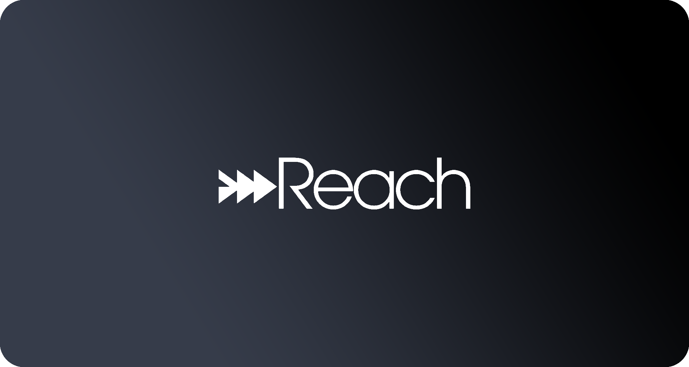
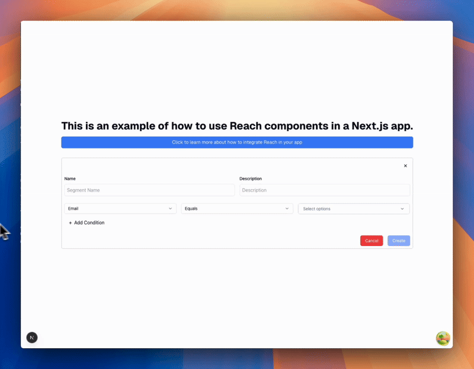

<div align="center">
  
  
  # 🚀 React Integration Example for Reach
  
  The simplest way to add powerful marketing automation to your small business software
</div>

<h2 align="center">✨ Demo</h2>

<div align="center">
  
</div>

<h2 align="center">🏃‍♂️ Getting Started</h2>

```bash
npm install
npm run dev
```

That's it! Visit `localhost:3000` to see the integration in action.

<h2 align="center">🛠️ Implementation</h2>

Check out [`src/app/page.tsx`](src/app/page.tsx) for a complete example of how to:

- 🔧 Configure the Reach provider
- 🔑 Set up authentication
- 🎯 Implement the Segment Builder component
- 🎨 Customize the theme to match your brand

<h2 align="center">💡 Need Help?</h2>

Visit our [documentation](https://docs.embedreach.com/embeddable-ui/react/introduction) for detailed integration guides and API references.

Always feel free to reach out to [support@embedreach.com](mailto:support@embedreach.com) if you have any questions! 💌
